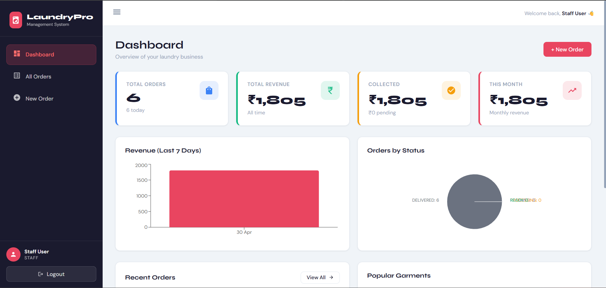
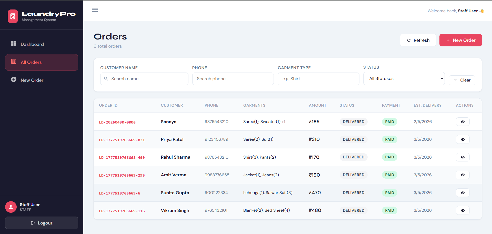
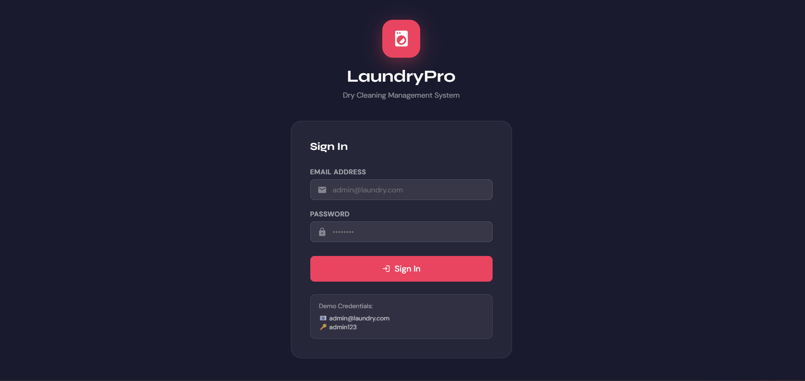
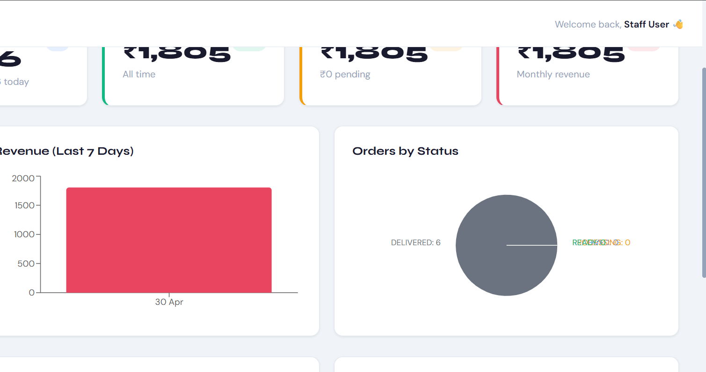

# 🧺 LaundryPro — Mini Laundry Order Management System

A full-stack MERN application for dry cleaning store management with Razorpay payment integration.

---

## 🚀 Setup Instructions

### Prerequisites
- Node.js v18+
- MongoDB (local or MongoDB Atlas)
- Razorpay account (for payments)

### 1. Clone / Unzip the project
```bash
unzip laundry-app.zip
cd laundry-app
```

### 2. Backend Setup
```bash
cd backend
cp .env.example .env
# Edit .env with your values
npm install
```

**Backend `.env` file:**
```env
PORT=5000
MONGODB_URI=mongodb://localhost:27017/laundry_db
JWT_SECRET=your_super_secret_key
JWT_EXPIRE=7d
RAZORPAY_KEY_ID=rzp_test_xxxxxxxxxxxxxxxx
RAZORPAY_KEY_SECRET=xxxxxxxxxxxxxxxxxxxxxxxx
```

### 3. Seed the database (optional but recommended)
```bash
node seeder.js
```
This creates:
- Admin: `admin@laundry.com` / `admin123`
- Staff: `staff@laundry.com` / `staff123`
- 5 sample orders

### 4. Start Backend
```bash
npm run dev     # development (with nodemon)
npm start       # production
```
API runs at: `http://localhost:5000`

### 5. Frontend Setup
```bash
cd ../frontend
cp .env.example .env
# Edit .env with your Razorpay Key ID
npm install
npm start
```
App runs at: `http://localhost:3000`

---

### 🎥 Demo / Screenshots
<h2>🎥 Demo / Screenshots</h2>

<table>
  <tr>
    <td align="center">
      <b>Dashboard</b><br>
      
    </td>
    <td align="center">
      <b>Orders Page</b><br>
      
    </td>
  </tr>

  <tr>
    <td align="center">
      <b>Login Page</b><br>
      
    </td>
    <td align="center">
      <b>Revenue Chart</b><br>
      
    </td>
  </tr>
</table>


### 🐳 Docker (Recommended for deployment)
```bash
# From project root
RAZORPAY_KEY_ID=your_key RAZORPAY_KEY_SECRET=your_secret docker-compose up -d
```
Access: Frontend at `http://localhost:3000`, API at `http://localhost:5000`

### ☁️ Deploy to Render.com (Free)

**Backend:**
1. Create new Web Service → connect GitHub repo
2. Root directory: `backend`
3. Build: `npm install`
4. Start: `node server.js`
5. Add all env variables

**Frontend:**
1. Create new Static Site
2. Root directory: `frontend`
3. Build: `npm run build`
4. Publish: `build`
5. Set `REACT_APP_API_URL` to your backend URL

---

## ✅ Features Implemented

### Core Features
| Feature | Status |
|---------|--------|
| Create Order with garments | ✅ |
| Unique Order ID generation | ✅ |
| Automatic bill calculation | ✅ |
| Order status management (RECEIVED → PROCESSING → READY → DELIVERED) | ✅ |
| View all orders | ✅ |
| Filter by status, name, phone, garment type | ✅ |
| Pagination | ✅ |
| Dashboard with totals | ✅ |
| Revenue & order charts | ✅ |

### Bonus Features
| Feature | Status |
|---------|--------|
| React frontend | ✅ |
| JWT Authentication | ✅ |
| Role-based access (admin/staff) | ✅ |
| MongoDB storage | ✅ |
| Search by garment type | ✅ |
| Estimated delivery date | ✅ |
| Razorpay payment integration | ✅ |
| Payment verification | ✅ |
| Status history tracking | ✅ |
| Postman collection | ✅ |
| Docker support | ✅ |
| Seeder script | ✅ |

---

## 🤖 AI Usage Report

### Tools Used
- **Claude (Anthropic)** — Primary tool for scaffolding, logic, and UI
- **GitHub Copilot** — Inline completions during development

---

### Sample Prompts Used

**Prompt 1 — Project scaffolding:**
> "Build a MERN stack laundry order management system with: order creation, status tracking (RECEIVED/PROCESSING/READY/DELIVERED), billing calculation, dashboard stats, and Razorpay integration. Give me the complete folder structure."

**Prompt 2 — Mongoose model:**
> "Create a Mongoose Order schema with garment types (Shirt, Pants, Saree, etc.), auto-generated Order ID like LD-20240101-0001, status history tracking, estimated delivery date, and Razorpay payment fields."

**Prompt 3 — Dashboard aggregations:**
> "Write MongoDB aggregation pipelines for: total orders, revenue, orders per status, today's orders, monthly revenue, top 5 garment types by quantity."

**Prompt 4 — React dashboard:**
> "Create a React dashboard page that shows stat cards, a Recharts bar chart for daily revenue, and a pie chart for order status distribution. Use clean design with CSS variables."

**Prompt 5 — Razorpay integration:**
> "Implement full Razorpay payment flow in Express + React: create order on backend, load Razorpay checkout.js on frontend, verify payment signature with HMAC SHA256."

---

### Where AI Helped
- ✅ Boilerplate code (Express server, middleware, routes) — saved ~2 hours
- ✅ MongoDB aggregation pipelines for dashboard — complex but AI got it right
- ✅ JWT auth flow — standard pattern, AI nailed it
- ✅ Razorpay backend integration — correct API structure
- ✅ React component structure and state management

### Where AI Got It Wrong / What I Fixed
- ❌ **Order ID generation race condition** — AI used a simple counter that could duplicate IDs under concurrent requests. Fixed by using `countDocuments()` + timestamp-based ID.
- ❌ **Razorpay signature verification** — AI initially used wrong field order in HMAC. Fixed: `razorpay_order_id + "|" + razorpay_payment_id` (not reversed).
- ❌ **MongoDB query for dual ID lookup** — AI wrote a findById that didn't support looking up by orderId string. Fixed with `$or` query.
- ❌ **React Router v6 changes** — AI generated `<Switch>` and `<Redirect>` (v5 syntax). Updated to `<Routes>` and `<Navigate>`.
- ❌ **CORS config** — AI allowed all origins in production. Fixed to use env variable for frontend URL.

---

## ⚖️ Tradeoffs

### What I Skipped
- Email notifications when order is ready
- PDF invoice generation
- Multi-store support
- Inventory/stock tracking
- SMS alerts via Twilio

### What I'd Improve with More Time
- Add real-time updates via WebSockets (order status live refresh)
- Barcode/QR code for each order
- Customer-facing order tracking page (no login needed, just phone + order ID)
- Export orders to Excel
- Bulk status update
- Push notifications

---

## 📡 API Reference

### Auth
| Method | Endpoint | Description |
|--------|----------|-------------|
| POST | `/api/auth/register` | Register user |
| POST | `/api/auth/login` | Login |
| GET | `/api/auth/me` | Current user |

### Orders
| Method | Endpoint | Description |
|--------|----------|-------------|
| POST | `/api/orders` | Create order |
| GET | `/api/orders` | List orders (filterable) |
| GET | `/api/orders/:id` | Get order |
| PATCH | `/api/orders/:id/status` | Update status |
| PUT | `/api/orders/:id` | Edit order |
| DELETE | `/api/orders/:id` | Delete (admin) |
| GET | `/api/orders/garment-prices` | Price list |

### Dashboard
| Method | Endpoint | Description |
|--------|----------|-------------|
| GET | `/api/dashboard` | All stats |
| GET | `/api/dashboard/revenue-chart` | Chart data |

### Payments
| Method | Endpoint | Description |
|--------|----------|-------------|
| POST | `/api/payment/create-order` | Create Razorpay order |
| POST | `/api/payment/verify` | Verify payment |
| GET | `/api/payment/:orderId` | Payment details |

---

## 🧾 Garment Price List (Default)

| Garment | Price |
|---------|-------|
| Shirt | ₹30 |
| Pants | ₹40 |
| Saree | ₹80 |
| Suit | ₹150 |
| Jacket | ₹100 |
| Dress | ₹90 |
| Kurta | ₹50 |
| Lehenga | ₹200 |
| Blanket | ₹120 |
| Bed Sheet | ₹60 |
| Sherwani | ₹250 |
| T-Shirt | ₹25 |

> Prices can be overridden per order via the API.

---

## 🗂️ Project Structure

```
laundry-app/
├── backend/
│   ├── controllers/
│   │   ├── authController.js
│   │   ├── orderController.js
│   │   ├── dashboardController.js
│   │   └── paymentController.js
│   ├── middleware/
│   │   └── auth.js
│   ├── models/
│   │   ├── User.js
│   │   └── Order.js
│   ├── routes/
│   │   ├── authRoutes.js
│   │   ├── orderRoutes.js
│   │   ├── dashboardRoutes.js
│   │   └── paymentRoutes.js
│   ├── server.js
│   ├── seeder.js
│   ├── Dockerfile
│   └── package.json
├── frontend/
│   ├── src/
│   │   ├── components/Layout.js
│   │   ├── context/AuthContext.js
│   │   ├── pages/
│   │   │   ├── Login.js
│   │   │   ├── Dashboard.js
│   │   │   ├── Orders.js
│   │   │   ├── CreateOrder.js
│   │   │   └── OrderDetail.js
│   │   ├── utils/api.js
│   │   ├── App.js
│   │   └── index.css
│   ├── Dockerfile
│   ├── nginx.conf
│   └── package.json
├── assets
    ├── login.png
    ├── dashboard.png
    |── chart.png
    └── orders.png
├── LaundryPro_Postman_Collection.json
├── docker-compose.yml
└── README.md
```

---

Built with ❤️ using MERN Stack + Razorpay
